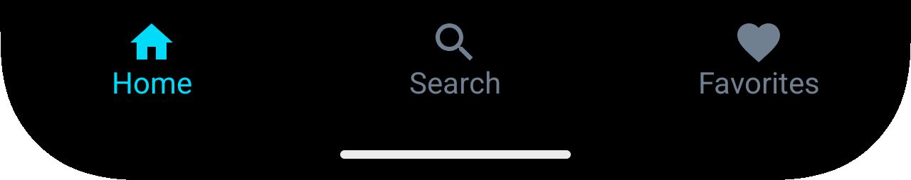

# Bottom Navigation Bar

[Back to index](index.md)



Bottom navigation is present on almost every screen of the application.

### Click - Tab Home

```kotlin
val params = Bundle().apply {
    putString("custom_path", "/bottom-navigation")
    putString("detail", "home")
}

analytics.logEvent("click", params)
```

### Click - Tab Search

```kotlin
val params = Bundle().apply {
    putString("custom_path", "/bottom-navigation")
    putString("detail", "search")
}

analytics.logEvent("click", params)
```

### Click - Tab Favorite

```kotlin
val params = Bundle().apply {
    putString("custom_path", "/bottom-navigation")
    putString("detail", "favorites")
}

analytics.logEvent("click", params)
```

[Back to index](index.md)

