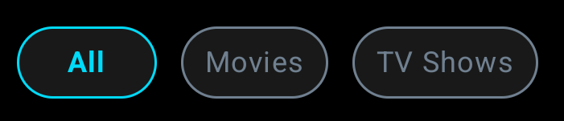

# Favorites Screen

[Back to index](index.md)


### Screen View

```kotlin
val params = Bundle().apply {
    putString("custom_path", "/favorites")
    putString("status", "<STATUS>")
}

analytics.logEvent("screen_view", params)
```
> **Status** parameter could be **loading**, **success**, **error** or **nothing-found**.


### Media Type 



#### Click – Select Media Type 

```kotlin
val params = Bundle().apply {
    putString("custom_path", "/favorites")
    putString("detail", "select-media-type:<MEDIA-TYPE>")
}

analytics.logEvent("click", params)
```
>  - Possible values for the **MEDIA-TYPE** value are: **all**, **movie**, or **tv**. For example, if selected filter is **'all'**, the **"detail"** will be: **"media-type:all"**.


### Media Item


#### Click

```kotlin
val params = Bundle().apply {
    putString("custom_path", "/favorites")
    putString("detail", "media-item")
    putLong("item_id", 42L) // This id value will change dinamically.
}

analytics.logEvent("click", params)
```

> - In this tagging we will create a logic to get the **media** id clicked dynamically.

[Back to index](index.md)
