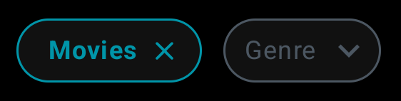
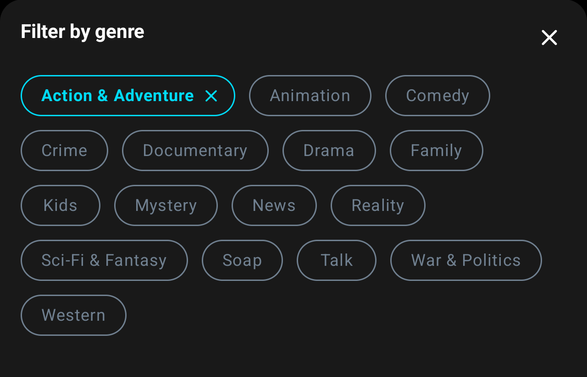

# Home Screen
[Back to index](index.md)


## Screen View

```kotlin
val params = Bundle().apply {
    putString("custom_path", "/home")
    putString("status", "<STATUS>")
}

analytics.logEvent("screen_view", params)
```
> - Possible values for the **STATUS** parameter are: **loading**, **success**, **error**, or **nothing-found**.

## Select Streaming


### Click

```kotlin
val params = Bundle().apply {
    putString("custom_path", "/home")
    putString("detail", "select-streaming")
}

analytics.logEvent("click", params)
```

## Media Type 


### Click – Select Media Type 

```kotlin
val params = Bundle().apply {
    putString("custom_path", "/home")
    putString("detail", "select-media-type:<MEDIA-TYPE>")
}

analytics.logEvent("click", params)
```
>  - Possible values for the **MEDIA-TYPE** value are: **all**, **movie**, or **tv**. For example, if selected filter is **'tv'**, the **"detail"** will be: **"select-media-type:tv"**.

### Click – Unselect Media Type

```kotlin
val params = Bundle().apply {
    putString("custom_path", "/home")
    putString("detail", "unselect-media-type:<MEDIA-TYPE>")
}

analytics.logEvent("click", params)
```
>  - Possible values for the **MEDIA-TYPE** value are: **movie** and **tv**. For example, if unselected filter is **'tv'**, the **"detail"** will be: **"unselect-media-type:tv"**.

## Genre Filter

### Click - Open Genre Filter



> - When a **media type** is selected, the **genre button** will appear on the screen. 

```kotlin
val params = Bundle().apply {
    putString("custom_path", "/home")
    putString("detail", "open-genre-filter")
}

analytics.logEvent("click", params)
```



> - When a **genre button** is clicked, the **genre options** will appear on the screen. 

### Click - Close Genre Filter

```kotlin
val params = Bundle().apply {
    putString("custom_path", "/home")
    putString("detail", "close-genre-filter")
    
}

analytics.logEvent("click", params)
```

### Click - Select Genre

```kotlin
val params = Bundle().apply {
    putString("custom_path", "/home")
    putString("detail", "select-genre")
    putLong("item_id", 42L) // This id value will change dinamically.
}

analytics.logEvent("click", params)
```
> - In this tagging we will create a logic to get the **genre** id clicked dynamically.

### Click - Unselect Genre

```kotlin
val params = Bundle().apply {
    putString("custom_path", "/home")
    putString("detail", "unselect-genre")
    putLong("item_id", 42L) // This id value will change dinamically.
}

analytics.logEvent("click", params)
```

> - In this tagging we will create a logic to get the **genre** id clicked dynamically.


## Media Item


### Click

```kotlin
val params = Bundle().apply {
    putString("custom_path", "/home")
    putString("detail", "media-item")
    putLong("item_id", 42L) // This id value will change dinamically.
}

analytics.logEvent("click", params)
```

> - In this tagging we will create a logic to get the **media** id clicked dynamically.

[Back to index](index.md)
