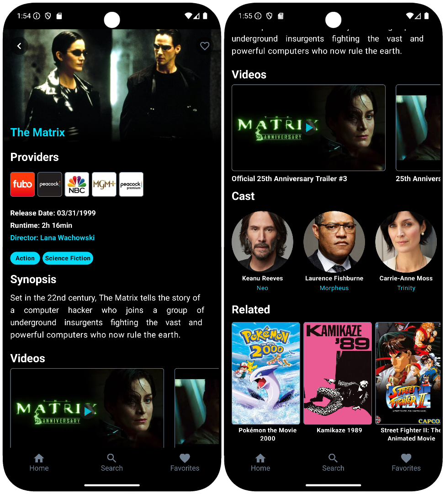

# Media Details Screen

[Back to index](index.md)



### Screen View

```kotlin
val params = Bundle().apply {
    putString("custom_path", "/media-details")
    putString("status", "<STATUS>") 
}

analytics.logEvent("screen_view", params)
```
> - Possible values for the **STATUS** parameter are: **loading**, **success**, or **error**.


### Click – Back

```kotlin
val params = Bundle().apply {
    putString("custom_path", "/media-details")
    putString("detail", "back")
}

analytics.logEvent("click", params)
```

### Click – Like

```kotlin
val params = Bundle().apply {
    putString("custom_path", "/media-details")
    putString("detail", "like:<STATUS>")
}

analytics.logEvent("click", params)
```

> - Possible values for the **STATUS** parameter are: **activating** and **deactivating**.


### Providers


#### Click 
```kotlin
val params = Bundle().apply {
    putString("custom_path", "/media-details")
    putString("detail", "select-streaming")
    putLong("item_id", 42L) // This id value will change dinamically.
}

analytics.logEvent("click", params)
```
> - In this tagging we will create a logic to get the **streaming** id clicked dynamically.

### Genres


#### Click 
```kotlin
val params = Bundle().apply {
    putString("custom_path", "/media-details")
    putString("detail", "select-genre")
     putLong("item_id", 42L) // This id value will change dinamically.
}

analytics.logEvent("click", params)
```
> - In this tagging we will create a logic to get the **genre** id clicked dynamically.


### Videos


#### Click 
```kotlin
val params = Bundle().apply {
    putString("custom_path", "/media-details")
    putString("detail", "video")
}

analytics.logEvent("click", params)
```


### Media Item


#### Click

```kotlin
val params = Bundle().apply {
    putString("custom_path", "/media-details")
    putString("detail", "media-item")
    putLong("item_id", 42L) // This id value will change dinamically.
}

analytics.logEvent("click", params)
```

> - In this tagging we will create a logic to get the **media** id clicked dynamically.

[Back to index](index.md)
