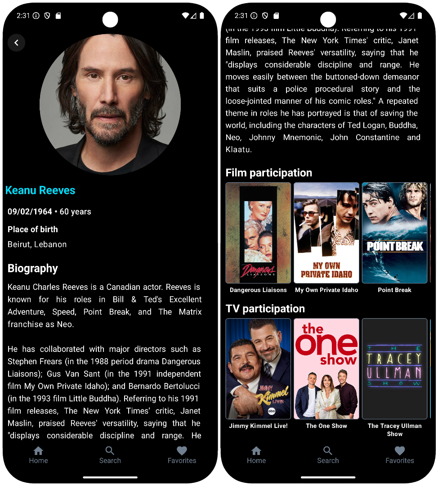

# Person Details Screen

[Back to index](index.md)



### Screen View

```kotlin
val params = Bundle().apply {
    putString("custom_path", "/person-details")
    putString("status", "<STATUS>") 
}

analytics.logEvent("screen_view", params)
```
> - Possible values for the **STATUS** parameter are: **loading**, **success**, or **error**.

### Media Item


#### Click

```kotlin
val params = Bundle().apply {
    putString("custom_path", "/person-details")
    putString("detail", "media-item")
}

analytics.logEvent("click", params)
```

[Back to index](index.md)