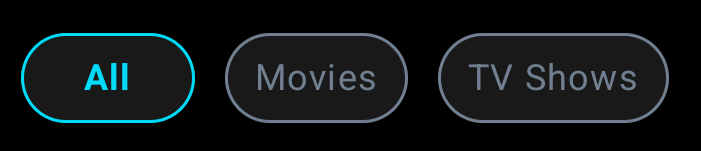
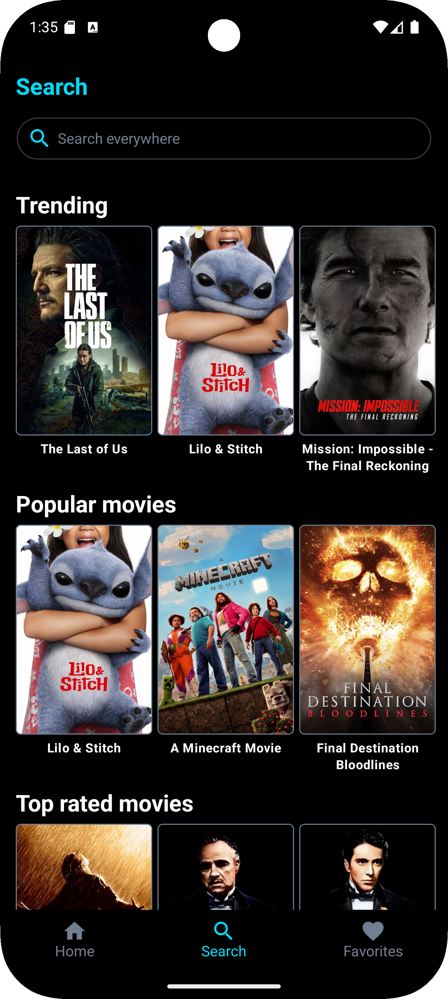

# Search Screen

[Back to index](index.md)

This screen will show media suggestions before you start searching. For this reason, we will use two **"custom_path"** parameters: **"/search"** and **"/search:suggestions"**.


## Search

### Screen View


```kotlin
val params = Bundle().apply {
    putString("custom_path", "/search")
    putString("status", "<STATUS>") 
}

analytics.logEvent("screen_view", params)
```
> - Possible values for the **STATUS** parameter are: **loading**, **success**, **error**, or **nothing-found**.


### Search Field 


#### Interaction

```kotlin
val params = Bundle().apply {
    putString("custom_path", "/search")
    putString("detail", "search-field")
}

analytics.logEvent("interaction", params)
```

#### Click – Clean

```kotlin
val params = Bundle().apply {
    putString("custom_path", "/search")
    putString("detail", "clean-search-field")
}

analytics.logEvent("click", params)
```

### Media Type 



#### Click – Select Media Type 

```kotlin
val params = Bundle().apply {
    putString("custom_path", "/search")
    putString("detail", "media-type:<MEDIA-TYPE>")
}

analytics.logEvent("click", params)
```
>  - Possible values for the **MEDIA-TYPE** value are: **all**, **movie**, or **tv**. For example, if selected filter is **'all'**, the **"detail"** will be: **"media-type:all"**.

### Media Item


### Click

```kotlin
val params = Bundle().apply {
    putString("custom_path", "/search")
    putString("detail", "media-item")
}

analytics.logEvent("click", params)
```

## Suggestions



### Screen View

```kotlin
val params = Bundle().apply {
    putString("custom_path", "/search:suggestions")
    putString("status", "<STATUS>") 
}

analytics.logEvent("screen_view", params)
```

> - Possible values for the **STATUS** parameter are: **loading**, **success**, or **error**.


### Media Item


### Click

```kotlin
val params = Bundle().apply {
    putString("custom_path", "/search:suggestions")
    putString("detail", "media-item")
}

analytics.logEvent("click", params)
```


[Back to index](index.md)
