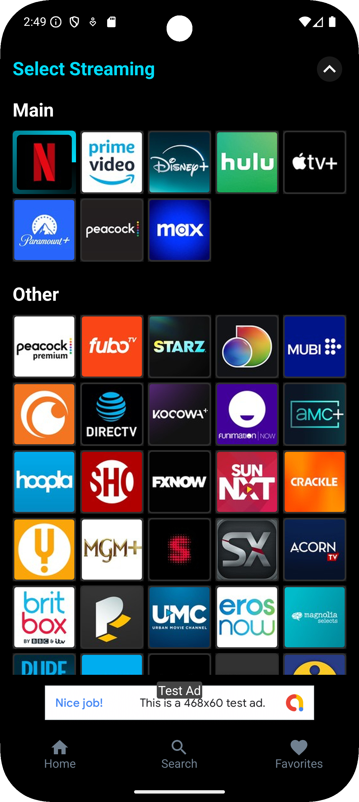

# Select Streaming Screen

[Back to index](index.md)



## Screen View

```kotlin
val params = Bundle().apply {
    putString("custom_path", "/select-streaming")
    putString("status", "<STATUS>") 
}

analytics.logEvent("screen_view", params)
```
> - Possible values for the **STATUS** parameter are: **loading**, **success**, or **error**.


### Click – Close screen

```kotlin
val params = Bundle().apply {
    putString("custom_path", "/select-streaming")
    putString("detail", "close")
}

analytics.logEvent("click", params)
```


### Click – Select Streaming

```kotlin
val params = Bundle().apply {
    putString("custom_path", "/select-streaming")
    putString("detail", "<STREAMING>")
}

analytics.logEvent("click", params)
```

> - The placeholder **STREAMING** will be replaced with the name of the selected streaming service.

[Back to index](index.md)
