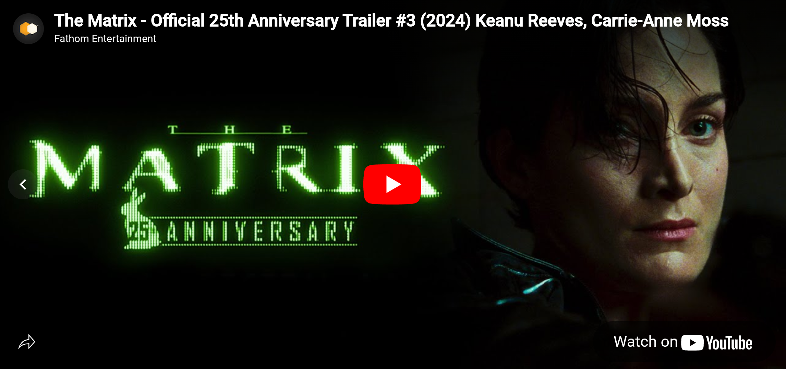

# YouTube Player Fullscreen 

[Back to index](index.md)




### Screen View

```kotlin
val params = Bundle().apply {
    putString("custom_path", "/player-fullscreen:youtube")
}

analytics.logEvent("screen_view", params)
```

> - There are no **status** parameters in this tag.


### Click – Close screen

```kotlin
val params = Bundle().apply {
    putString("custom_path", "/player-fullscreen:youtube")
    putString("detail", "close")
}

analytics.logEvent("click", params)
```


### Player Interaction

```kotlin
val params = Bundle().apply {
    putString("custom_path", "/player-fullscreen:youtube")
    putString("detail", "player-status:<STATUS>")
}

analytics.logEvent("interaction", params)
```

> - Possible values for the **STATUS** value are: **unknown**, **unstarted**, **ended**, **playing**, **paused**, **buffering**, or **video-cued**. For example, if video player status is **'playing'**, the **"detail"** will be: **"player-status:playing"**.


[Back to index](index.md)